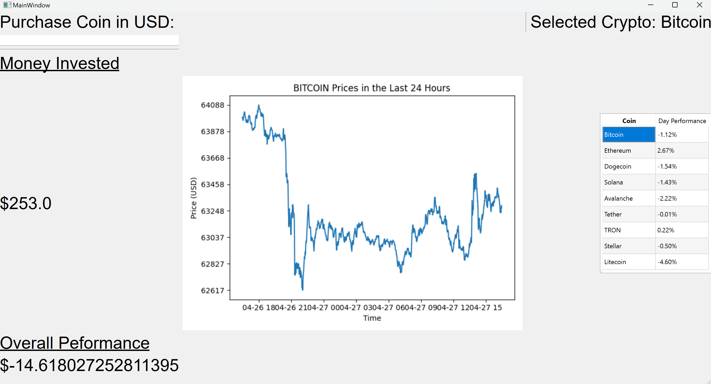
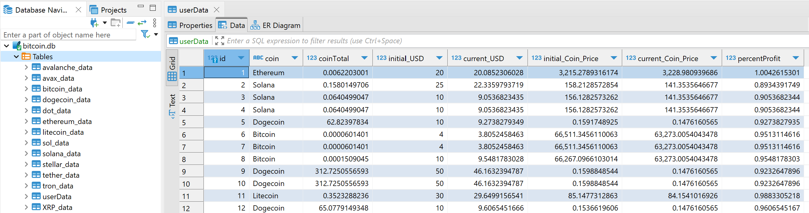

# BitBlitz

## Design Overview

BitBlitz is an application designed to be able to simulate cryptocurrecny trades. The software was developed utilizing QtDesigner and pyqt signals for both frontend and backend communication. It interfaces with the Coincap API to get accurate 24 hour data of the latest cryptocurrency prices. This data is fetched upon the start up of the program and is stored and used in databases utilizing sqLite. When the user clicks on the coin on the menu to the right, a plot of the latest 24 hour coin movements is displayed using matplotlib. The user also can simulate purchasing a coin by typing in the amount in USD in the left hand corner and hitting enter. In the class CrypoDatabase.py, there is the use of scripting SQL to manipulate and fetch from various databases holding information of different coins and the current user information of simulated sales. The software used to interface and view the databases is DBeaver, a universal database application. Here different tables are listed for Bitcoin, Ethereum, Dogecoin, Solana, Avalanche, Tether, TRON, Stellar, and Litecoin showing data that includes prices. UserData is a menu that shows what coins have already been bought, profits, and performance of each coin.

