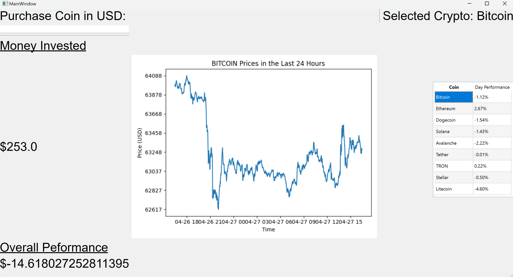
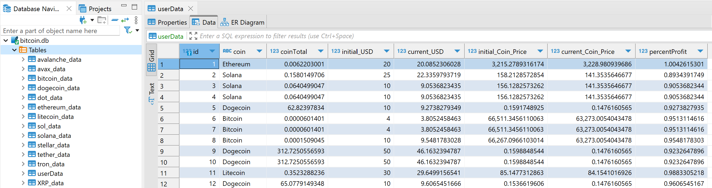
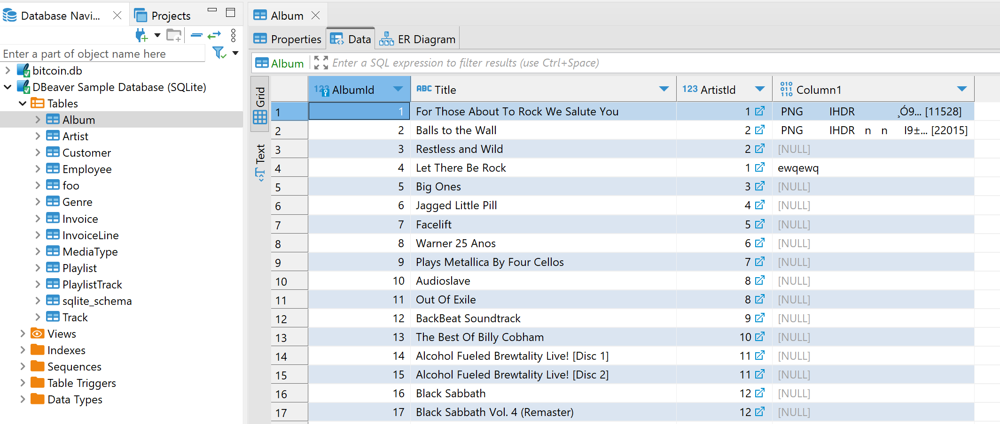
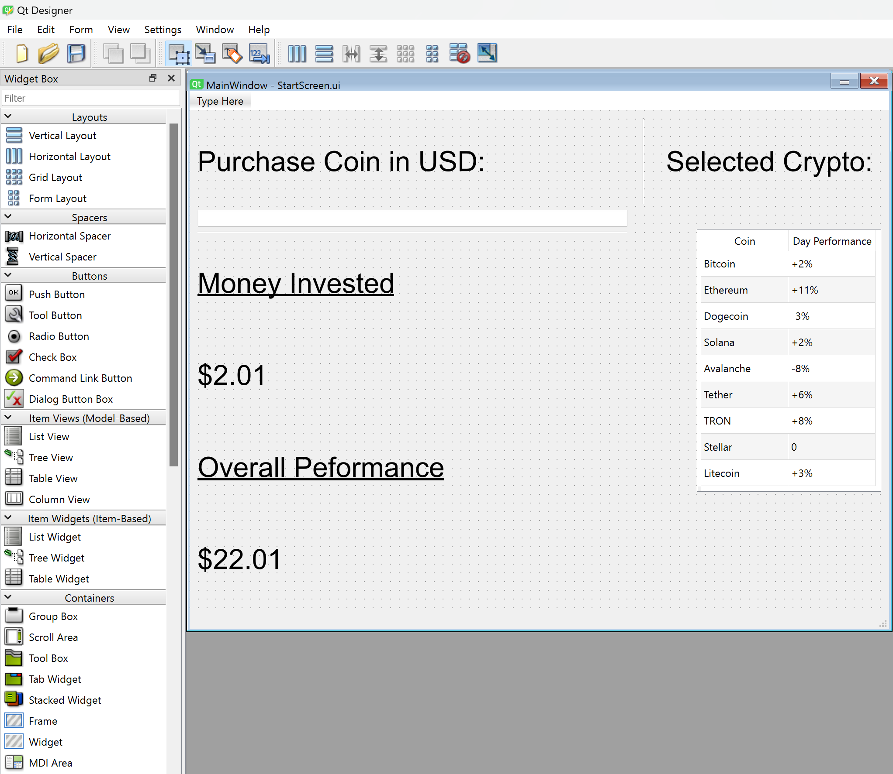
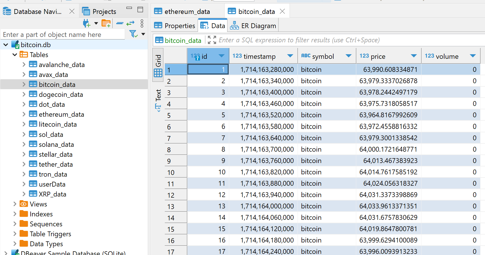

# BitBlitz

## Design Overview

BitBlitz is an application designed to be able to simulate cryptocurrecny trades. The software was developed utilizing QtDesigner and pyqt signals for both frontend and backend communication. It interfaces with the Coincap API to get accurate 24 hour data of the latest cryptocurrency prices. This data is fetched upon the start up of the program and is stored and used in databases utilizing sqLite. When the user clicks on the coin on the menu to the right, a plot of the latest 24 hour coin movements is displayed using matplotlib. The user also can simulate purchasing a coin by typing in the amount in USD in the left hand corner and hitting enter. In the class CrypoDatabase.py, there is the use of scripting SQL to manipulate and fetch from various databases holding information of different coins and the current user information of simulated sales. The software used to interface and view the databases is DBeaver, a universal database application. Here different tables are listed for Bitcoin, Ethereum, Dogecoin, Solana, Avalanche, Tether, TRON, Stellar, and Litecoin showing data that includes prices. UserData is a menu that shows what coins have already been bought, profits, and performance of each coin.

The original design concepts used were most of what is contained in this finalzied design. Going in, I always planned on using python, QtDesigner, APIs, and databases to construct the application. There are two aspects from my original design that are not yet in the application but will be in the future.

1. A CoinDesk API will eventually be used to execute the trades instead of just simulating them.
2. Machine learning will be implemented to allow for autonomous trading. This algorithm will be taught utilizing traditional indicators to try to time the price changes to make a profit. This will be a much more time intensive aspect of the application that will be done in the months to come.

This project is able to be a 6-week application because of what has already been implemented. The system already has the ability to get accurate coin data, display this to the user, and simulate trades. Adding real trading functionality will not be a challenging step. Additionally adding machine learning that learns from successful and failure trades will take time that will be done over the following months as I expand on this to be an intensive personal project.

## Preliminary Design Verification

There were various phases of preliminary design verification for my design. First, I looked into the what kind of UI to implement. Due to taking ECE 1140, I have become well versed in QtDesigner and pyqt signals, however, I was not sure how this would work with databases. I installed dBeaver (a software I use at my co-op) and refreshed myself with how to use it playing with a test database.

After getting used to dBeaver again, I decided to use sqLite because it was easilly configurable with python. I then ran some simpe tests to ensure my API was producing the correct results. Initially, the API I was original using was not going to work because it failed to provide good historical data for the last 24 hours. This caused me to do research and use Coincap instead. Testing this was successful and I was able to get accurate data from the API into a test bitcoin database table. Part of this initial phase of testing also included me refreshing myself on matplotlib to accurately graph the coin data. After some early struggles, I was successfully able to graph the latest 24 hour prices of bitcoin. From here, the last componenet I wanted to test was pyqt signals communicating with my databases tables. I was able to successfully push a dummy value from my UI to the database to ensure the functionality.

## Design Implementation

My overall design works in a tandum of three parts: frontend, backend, and database. The frontend UI code was generated using QtDesigner.

The widgets provided by QtDesigner allow for a pleasant user interface while making the backend connection effective. I utilized different tables, labels, images, and text lines to communicate information about the coins and previous user data.

The backend code consisted of two classes: main.py and CryptoDatabase.py.

main.py took care of bringing the frontend and backend components together, loading the UI, calling on a CryptoDatabase object to update the last 24 hour information, and handling user actions that were slotted with pyqt signals to connect to the backend. Relevant functions included handleCellClick (used to show the correct coin image for the last 24 hours), buyCoin (allowed users to simulate buying coins), and updateData (used to update the price data of all coins and the performance of the user). 

CryptoDatabase.py handled the major functions of the backend code. It connected to the database tables, updated them, interfaced with the Coincap API, created plots of all used coins' recent data, simulated purchasing coins, and helped with updating the coin table shown to users. Encapsulating these functions in this object allowed to a clean level of organization and ease of use with implementing the object in main.py. Relavent functions included create_table (created database tables if they did not exist), fetch_realtime_data (used the API to get the current data of a desired coin), update_historical_table (updated the last 24 hours worth of data for a desired coin), and plot_recent_prices (used matplotlib to create images of the 24 hour information for a given coin).

The database tables were called on and updated using the backend functionality with the Coincap API. sqLite is easy to interface with python and allowed relatively easy scripting to be done in the actual python code. Using dBeaver allowed me to view the current coin data and user purchase data to easilly assess if the application was doing what it needed to do. It holds a table for each coin with price data alongside a userData table to track the latest purchases done on the app.

The design proccess went relatively smooth. The biggest challenge was learning about the limitations each component of my system had. The frontend display did not always have as many options as I liked, pyqt signals in the backend have some limitations and performance issues, and updating so much information in the database tables became quite time consuming. With designing, I overcame this by being aware of the limitations each of these subsystems had an tried to alleviate them by utilizing the strenghts in the other subsystems. This allowed better results in one area when I was not always content in the results of a different one.

## Design Testing